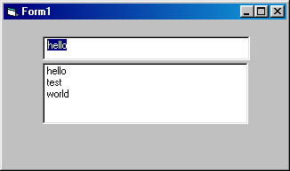

<div align="center">

## Very Simple AutoComplete


</div>

### Description

I needed a fast easy and uncomplecated AutoComplete code and this is what i came with.
 
### More Info
 


<span>             |<span>
---                |---
**Submitted On**   |2002-06-11 11:28:28
**By**             |[Shlomo](https://github.com/Planet-Source-Code/PSCIndex/blob/master/ByAuthor/shlomo.md)
**Level**          |Beginner
**User Rating**    |4.5 (18 globes from 4 users)
**Compatibility**  |VB 5\.0, VB 6\.0
**Category**       |[Coding Standards](https://github.com/Planet-Source-Code/PSCIndex/blob/master/ByCategory/coding-standards__1-43.md)
**World**          |[Visual Basic](https://github.com/Planet-Source-Code/PSCIndex/blob/master/ByWorld/visual-basic.md)
**Archive File**   |[Very\_Simpl928766112002\.zip](https://github.com/Planet-Source-Code/shlomo-very-simple-autocomplete__1-35709/archive/master.zip)

### API Declarations

```
Private Declare Function SendMessage Lib "user32" Alias "SendMessageA" _
  (ByVal hwnd As Long, ByVal wMsg As Long, ByVal wParam As Long, ByVal lParam As Any) As Long
  Private Const LB_FINDSTRING = &H18F
  Private Const LB_FINDSTRINGEXACT = &H1A2
```


